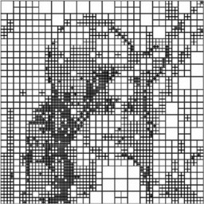

F.I.C. &hArr; Fractal Image Compression
=======================================

An open source library written in Java, implementing the concepts of
[fractal image compression][wiki],
along with a simple implementation &mdash; a proof of concept application.

  [wiki]: http://en.wikipedia.org/wiki/Fractal_compression

  
  
  

<pre>       input image       →     partition sheme     →      output image</pre>

&raquo; Brought to you, by
---------------------------
* Kanakarakis [_c00kiemon5ter_][blog] Ivan &mdash; p3060190
* Ntanasis Periklis &mdash; p3070130
* Sarbinowski Pavlos &mdash; p3080179

  [blog]: http://c00kiemon5ter.github.com

